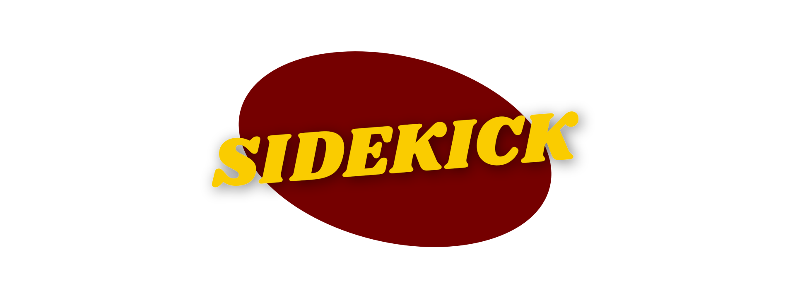

## 🦸 Holy plot points!

**Sidekick** is a creative storyteller's trusty companion! Map out the connections between characters, locations, and "sections" of your outline.

## 🤔 Goal

Sidekick aims to provide an intuitive way for writers to plan and connect important elements of their story. The goal is to facilitate the process of discovering connections and through-lines that serve your creative vision.

## 🌱 Project Status

**Sidekick** is early in its journey. Here's the plan:

### **Core features**

✅: Completed<br>
🔨: In progress<br>
⏹️: Planned
<br>

- ✅ **100% local**: Sidekick is a [local-only](https://dev.to/alexanderop/what-is-local-first-web-development-3mnd) app. Your projects never leave your device, keeping them away from servers, AI datasets, or anywhere else you may not want them. 
- 🔨️ **Export and import**: Easily save your project to a file, for safekeeping or to import on another device
- ⏹️ **Progressive web app**: (Optionally) install Sidekick as a PWA, allowing for a native-like experience on any device
- 🔨️ **Create story elements**: Flesh out your story with an outline, themes, locations, and interrelated characters
    - 🔨 **Sections**: Create and easily flesh out story moments/scenes. Each can link to related characters and locations
    <!-- - ⏹️ **Themes**: Lay out over-arching ideas that tie your story together, and easily view them from anywhere in the app -->
    - ✅ **Characters**: Describe your story's characters with several useful prompts
        - 🔨️ **Character dynamics**: Link characters to each other and describe their relationship
    - ✅ ️ **Locations**: Describe your story's vibrant settings
- ⏹️ **Link suggestions**: Mention an unlinked story element, and Sidekick will automatically suggest a link, making it easy to create potentially useful connections


## ✨ Getting started

⚠️ This is a work in progress, and missing key features. If you're here for a functional app, please check again later.

You can access the latest deployed version of the app at sidekick.dannymendiola.com

If you'd like to contribute, or run the entire app locally, you can always get it straight from the source:

1. Install [Git](https://git-scm.com/downloads) and [Node](https://nodejs.org/en) if necessary
2. Open a terminal in the folder where you'd like to download Sidekick, and run:

```bash
git clone https://github.com/dannymendiola/sidekick
cd sidekick
npm install
npm run build
npm run preview
```

If the app doesn't open in your browser automatically, you can access it by entering `localhost:2127` in the browser address bar

To stop the app, type `q` in the running terminal and enter

## 🛠️ Contributing

Contributions are welcome -- poke around as you see fit!

## 💡 Inspirations and Tools

Sidekick owes much of its inspiration and existence to several tools and projects. Check 'em out:

- Essential libraries:
    - [Svelte](https://svelte.dev/)
    - [Tailwindcss](https://tailwindcss.com/) and their [icon library](https://heroicons.com/)
    - [Tiptap](https://tiptap.dev/)
- Inspirations:
    - [Pluot](https://pluot.app/)
    - [Obsidian](https://obsidian.md/)
    - [Home for Fiction](https://homeforfiction.com)'s apps, especially [Narrative Nods](https://homeforfiction.com/apps/#nnods)
    - [Some wise words](https://youtu.be/85LUuF6ZXaU)